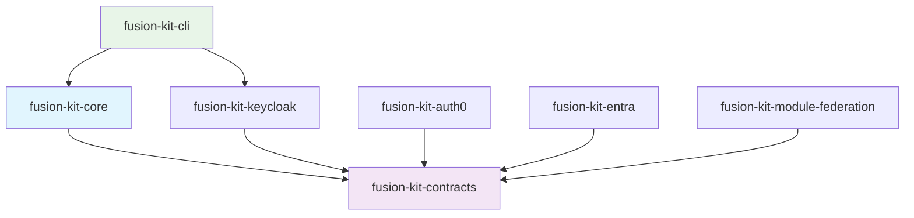

# FusionKit Packages

## Table of Contents

- [Core Package](#core-package)
- [Authentication Packages](#authentication-packages)
- [Development Tools](#development-tools)
- [Package Dependencies](#package-dependencies)

## Core Package

### fusion-kit-core

The foundational library providing essential services and utilities for building applications.

**[📖 Detailed Documentation](./fusion-kit-core.md)**

**Key Components:**
- **FusionApp**: Central application instance and lifecycle management
- **ServiceManager**: Type-safe service registration and retrieval
- **ConfigurationManager**: Unified configuration loading with authentication support
- **EncryptedSessionStorage**: AES-encrypted browser storage
- **UserFeedback**: Framework-agnostic user notification system
- **ConsoleLogger**: Structured logging with hierarchical levels
- **ModuleAuthService**: Simplified authentication wrapper for microfrontends

**Installation:**
```bash
npm install @inform-appshell/fusion-kit-core
```

## Authentication Packages

### fusion-kit-keycloak

Enterprise-grade authentication using Keycloak identity and access management.

**[📖 Detailed Documentation](./fusion-kit-keycloak.md)**

**Key Features:**
- Full Keycloak integration with PKCE support
- Token validation and refresh capabilities
- Single sign-on (SSO) and iframe monitoring
- Comprehensive user profile management
- Notification callbacks for auth events

**Installation:**
```bash
npm install @inform-appshell/fusion-kit-keycloak
```

### fusion-kit-auth0

Cloud-based authentication using Auth0 identity platform.

**[📖 Detailed Documentation](./fusion-kit-auth0.md)**

**Key Features:**
- Auth0 SDK integration
- User profile and token management
- Secure authentication flows
- AuthService interface compliance

**Installation:**
```bash
npm install @inform-appshell/fusion-kit-auth0
```

### fusion-kit-entra  (Beta)

Microsoft Entra (formerly Azure AD) identity platform integration.

**[📖 Detailed Documentation](./fusion-kit-entra.md)**

**Status:** In development

**Installation:**
```bash
npm install @inform-appshell/fusion-kit-entra
```

## Development Tools

### fusion-kit-cli

Command-line interface for rapid project scaffolding and setup.

**[📖 Detailed Documentation](./fusion-kit-cli.md)**

**Key Features:**
- Interactive project creation wizard
- Multi-framework support (Angular, React, Vue)
- Microfrontend and shell application templates
- Optional integrations (i18n, design systems, UI components)
- Development and production build configurations

**Installation:**
```bash
npm install -g @inform-appshell/fusion-kit-cli@latest
```

**Usage:**
```bash
# Interactive mode
fk create

# Create microfrontend
fk create mfe -n my-app

# Create shell application
fk create shell -n my-shell
```

### fusion-kit-module-federation

Utilities for managing remote modules in microfrontend architectures.

**[📖 Detailed Documentation](./fusion-kit-module-federation.md)**

**Key Features:**
- Remote module path construction and parsing
- Federation module manager for dynamic loading
- Health monitoring for remote modules
- Decoupled from specific federation implementations

**Installation:**
```bash
npm install @inform-appshell/fusion-kit-module-federation
```

### fusion-kit-contracts

Shared TypeScript interfaces and types for the entire FusionKit ecosystem.

**[📖 Detailed Documentation](./fusion-kit-contracts.md)**

**Key Components:**
- Authentication service interfaces (`AuthService`, `AuthUserProfile`)
- Logging interfaces (`Logger`, `LoggerOptions`)
- Remote module management (`RemoteManager`, `RemoteConfiguration`)
- UI framework adapters (`FrameAdapter`, notification types)
- Module interfaces (`Module`, `ModuleMenuItem`)

**Installation:**
```bash
npm install @inform-appshell/fusion-kit-contracts
```

## Package Dependencies



### Core Dependencies
- **fusion-kit-contracts**: Required by all packages for shared interfaces
- **fusion-kit-core**: Foundation package used by CLI and applications

### Authentication Dependencies
All authentication packages depend on `fusion-kit-contracts` for the `AuthService` interface.

### Development Dependencies
- **fusion-kit-cli**: Uses core package and authentication providers for scaffolding
- **fusion-kit-module-federation**: Implements remote module management contracts

## Getting Started

1. **Install the CLI**: `npm install -g @inform-appshell/fusion-kit-cli@latest`
2. **Create a project**: `fk create mfe -n my-app`
3. **Choose authentication**: Install appropriate auth package
4. **Add contracts**: Usually installed automatically with other packages

For detailed usage examples, see the [Examples section](../examples/index.md).